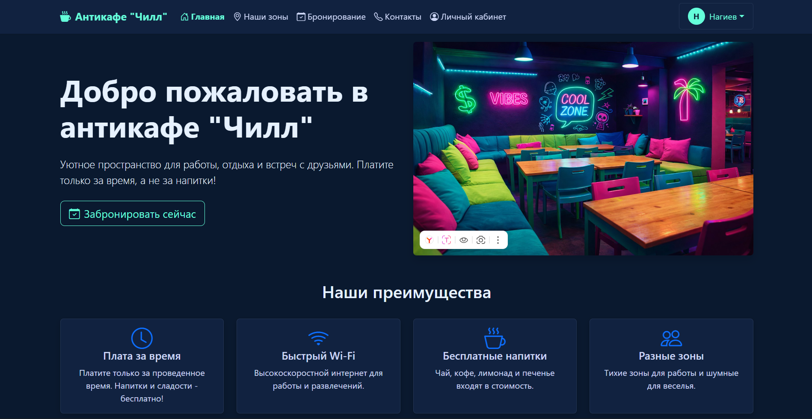
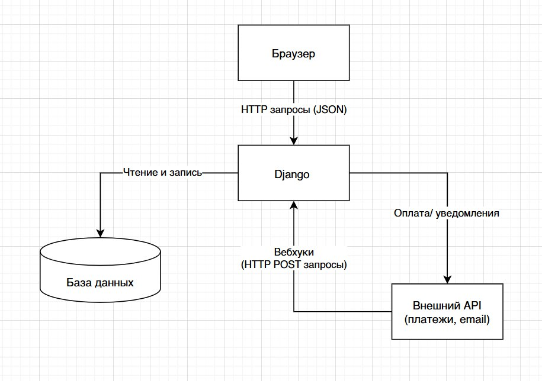

## Антикафе «Чилл» — Система бронирования

**Антикафе «Чилл»** — это автоматизированная система бронирования для антикафе, разработанная для удобства клиентов и повышения эффективности бизнеса.  
Система позволяет гостям быстро и прозрачно бронировать зоны, управлять своими визитами, а администраторам — контролировать загруженность, обрабатывать брони и анализировать статистику через встроенную админ-панель Django.

### Функциональность

- 🕒 **Бронирование времени и комнат**  
  Выбор зоны (стол, комната, общая зона), календарь доступности в реальном времени, расчёт стоимости по тарифам, мгновенное подтверждение.

- 👤 **Личный кабинет клиента**  
  Регистрация и авторизация, история бронирований, текущий статус посещения, управление профилем.

- 📊 **Панель управления для администратора (Django Admin)**  
  Просмотр загруженности зон в реальном времени, управление бронированиями (подтверждение, отмена, редактирование), статистика посещений и доходов.

- 🔐 **Безопасность и доступность**  
  Защищённая авторизация, ролевая модель доступа (клиент, администратор), адаптивный интерфейс.

- 📱 **Удобный интерфейс**  
  Современный и интуитивно понятный дизайн, поддержка мобильных устройств.

### Стек технологий

- **Backend**: Python 3.10+, Django 5.0
- **Frontend**: HTML5, CSS3, JavaScript (Vanilla), Django Templates
- **База данных**: SQLite (встроенная, для разработки)
- **Администрирование**: Django Admin
- **Инструменты**: Git

### Установка и запуск

#### Предварительные требования

- **Python** 3.10 или выше  
- **pip** (менеджер пакетов Python)  
- **Git** для клонирования репозитория

#### Пошаговая установка

1. **Клонируйте репозиторий и перейдите в папку проекта:**
git clone <repository-url>

2. **Создайте и активируйте виртуальное окружение:**
Windows
python -m venv venv
venv\Scripts\activate

Linux/Mac
python3 -m venv venv
source venv/bin/activate

3. **Установите зависимости:**
pip install -r requirements.txt

4. **Примените миграции базы данных:**
python manage.py migrate

5. **Создайте суперпользователя для доступа к админ-панели:**
python manage.py createsuperuser

6. **Запустите сервер разработки:**
python manage.py runserver

7. **Откройте браузер и перейдите по адресу:**
http://127.0.0.1:8000/

### Админ-панель

**После создания суперпользователя административная панель доступна по адресу:**
http://127.0.0.1:8000/admin/

В админке доступно управление:
- Пользователями
- Зонами (комнаты, столы, общие зоны)
- Бронированиями
- Тарифами
- Посещениями
- Историей бронирований

### Скриншоты интерфейса

1. **Главная страница (home.html)** 

2. **Страница бронирования (booking.html)**  

3. **Страница зон (zones.html)**  

4. **Личный кабинет (profile.html)**  

6. **Страница входа (login.html)**  

7. **Контакты (contacts.html)**  

### Структура базы данных (Модели Django)

*Основные модели проекта:*

- **User** — пользователи системы (клиенты и администраторы).
- **Zone** — зоны антикафе (комнаты, столы, общие зоны) с описанием, вместимостью и статусом.
- **Booking** — бронирования (связь пользователь-зона, время начала/окончания, стоимость, статус).
- **Tariff** — тарифы (цена за час, тип зоны, время действия).
- **Visit** — текущие посещения (время начала, окончания, статус).
- **BookingHistory** — история бронирований (архив завершённых броней).

### Архитектура проекта

1. **Клиент (браузер)** — запросы к серверу, отображение HTML-шаблонов.
2. **Django Backend** — обработка запросов, бизнес-логика в `views.py`, работа с базой данных через `models.py`.
3. **База данных (SQLite)** — хранение данных пользователей, зон, бронирований.
4. **Админ-панель (Django Admin)** — управление системой, мониторинг загруженности.

### Разработка

1. **Запуск в режиме разработки**
python manage.py runserver

2. **Создание миграций после изменения моделей**
python manage.py makemigrations

3. **Применение миграций**
python manage.py migrate

4. **Создание суперпользователя**
python manage.py createsuperuser

### Авторы

Мурина Софья, Хотеева Диана, Яматина Арина  
Группа: К0709-23/3